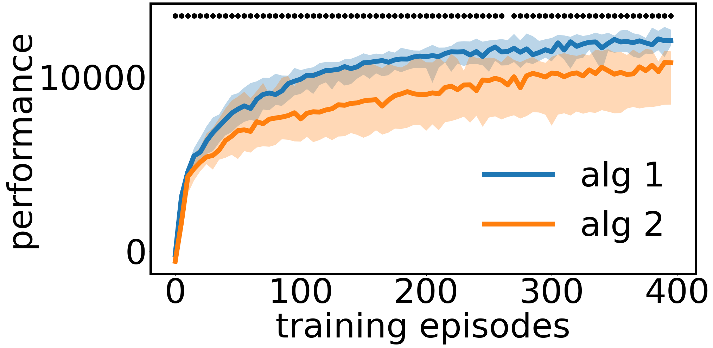

# A Hitchhiker's Guide to Statistical Comparisons of Reinforcement Learning Algorithms

Consistently checking the statistical significance of experimental results is the first mandatory step towards reproducible science. This library allows you to easily compare two RL algorithms with statistical tests, to plot their central tendencies, errors areas and to represent directly on the plot, where two learning curve differ significantly. 

This library comes with an experimental paper: 
[**A Hitchhiker's Guide to Statistical Comparisons of Reinforcement Learning Algorithms.**](https://arxiv.org/abs/1904.06979). In this paper, a variety of statistical tests are compared in terms of type-I and type-II errors when diverse assumptions about the performance distributions are violated. 

The code serves two purposes: reproducing the experiments from the paper and allowing users to implement rigorous testing and visualization of algorithm performances.

## RL algorithm comparisons made easy
You can use the command 
```
python run_tests.py --data1 path_to_data1 --data2 path_to_data2 --test_id welch --confidence_level 0.01 --id_central 'median' --id_central 80 --legends 'alg 1/alg 2'
```

`path_to_data` should be the path to a text file containing an array of shape (n_steps, n_seeds). The number of seeds and steps can differ between the two samples. This will save the figure under `./plot.png`.

Run `python run_tests.py -h` for more information about the arguments.

Running `python run_tests.py` with default arguments tests and plots 20 seeds of TD3 and SAC (see more on that below):

<p align="center">

</p>

To play with the code directly, you can look at the `example_test_and_plot.py` script, which exposes the details.

## Reproducing results of the paper:

### Running experiments:

`python3 run_experiment.py --study equal_dist_equal_var`

Possible studies:

* equal_dist_equal_var
* equal_dist_unequal_var
* unequal_dist_equal_var
* unequal_dist_unequal_var_1: here the first distribution is the one that has the smallest std
* unequal_dist_unequal_var_2: here the first distribution has the largest std

This creates a pickle file in ./data/equal_dist_equal_var/ for each pair of distributions.
A bash file is made available to launch the experiment on a slurm cluster.

It is advised to run the experiment with fewer iterations first, to make sure everything works.

### Plots and tables

* To obtain plots of the false positive rates as a function of the sample size for various tests,
just run the plot_false_positive.py script:

    `python3 plot_false_positive.py --study equal_dist_equal_var`

* To obtain code for latex table that contains the statistical power results use the table_from_results.py script:

  `python3 table_from_results.py --study equal_dist_equal_var`


## Test and plot two samples

`python3 example_test_and_plot.py`

The data we used are: 
* 192 runs of [Soft-Actor Critic](https://arxiv.org/abs/1801.01290) for 2M timesteps on [Half-Cheetah-v2](https://gym.openai.com/envs/HalfCheetah-v2/), using the [Spinning Up](https://github.com/openai/spinningup) implementation.
* 192 runs of [Twin-Delayed Deep Deterministic Policy Gradient](https://arxiv.org/abs/1802.09477) for 2M timesteps on [Half-Cheetah-v2](https://gym.openai.com/envs/HalfCheetah-v2/), using the [Spinning Up](https://github.com/openai/spinningup) implementation.

This example samples one sample of a given size from each, compares them using a statistical test and plot the learning curves, 
with error shades and dots indicating statistical significance.

The central tendency, the type of error, the test used, the confidence level and the sample size are tunable parameters.

## SAC and TD3 Performances

This repository also provides text files with learning curves for 192 runs of [Soft-Actor Critic](https://arxiv.org/abs/1801.01290) and 192 runs of [Twin-Delayed Deep Deterministic Policy Gradient](https://arxiv.org/abs/1802.09477)
run for 2M timesteps on [Half-Cheetah-v2](https://gym.openai.com/envs/HalfCheetah-v2/).
